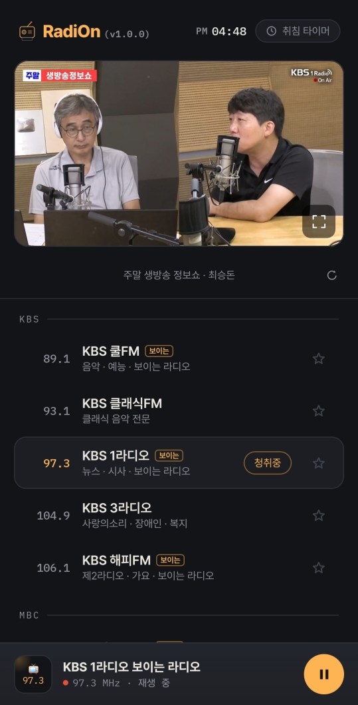
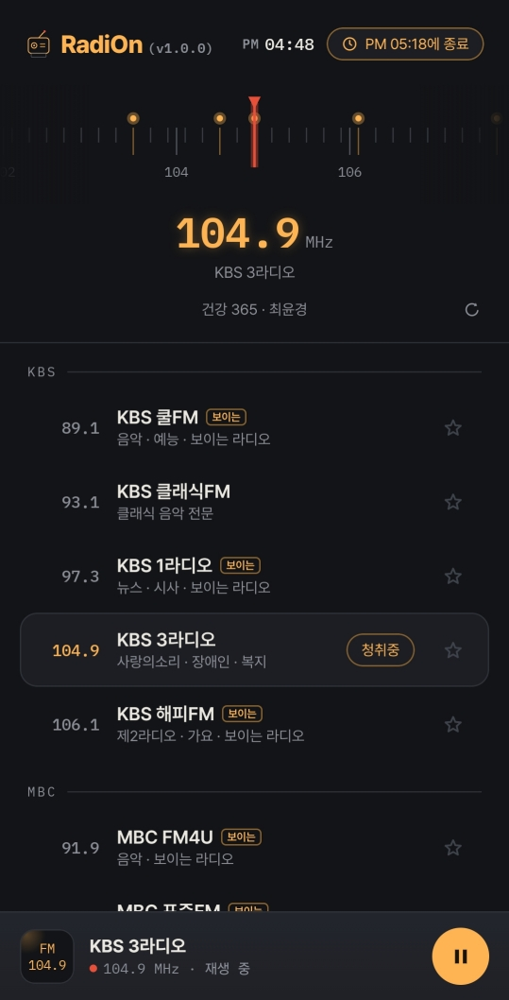
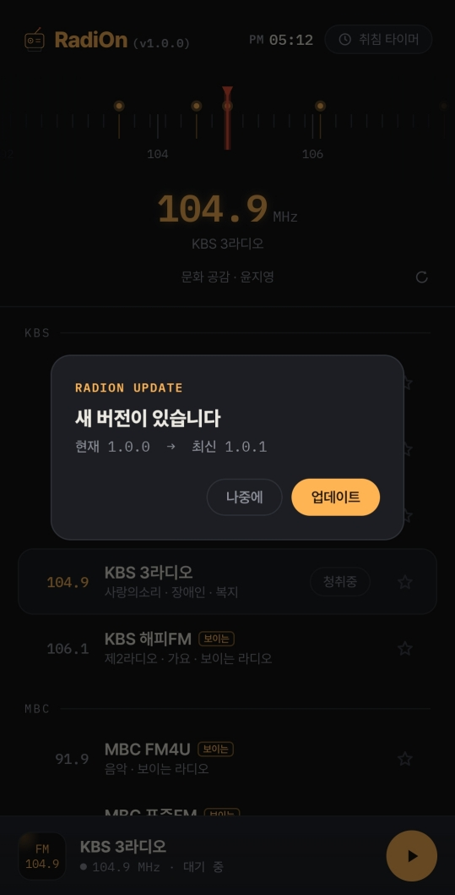

# 라디온 (RadiOn)

한국 지상파 라디오를 듣기 위한 개인용 안드로이드 앱입니다.

KBS·MBC·SBS·EBS·CBS·국악방송·TBS·YTN 등의 실시간 스트림을 아날로그 튜너 감성의 UI로 재생합니다.
방송사가 제공하는 "보이는 라디오"는 영상으로, 오디오 전용 채널은 FM 주파수 다이얼로 표시합니다.

---

## 기술 스택

| 영역 | 사용 기술 |
| --- | --- |
| 언어 | Kotlin 2.3.20 |
| UI | Jetpack Compose (Material 3, BOM 2025.09) |
| 재생 | AndroidX Media3 1.8.0 — ExoPlayer + HLS + MediaSession |
| 백그라운드 재생 | `MediaSessionService` 기반 포그라운드 서비스 |
| 비동기 | Kotlin Coroutines / Flow |
| 직렬화 | kotlinx.serialization (채널 목록·API 응답 파싱) |
| 로컬 저장 | DataStore Preferences (마지막 채널, 즐겨찾기) |
| 네트워크 | `HttpURLConnection` 직접 래핑 (외부 HTTP 라이브러리 없음) |
| 빌드 | Gradle 9.1 + AGP 9.0.1, AGP 내장 Kotlin 컴파일 |
| 최소 사양 | minSdk 26 (Android 8.0) / targetSdk 36 |

---

## 기능 소개

### 방송 정보 표시 · 보이는 라디오

- 재생 화면 바로 아래에 **지금 방송 중인 프로그램 제목 · 진행자 · 게스트 · 선곡 정보**를 한 줄로 보여 줍니다.
  방송사마다 주는 항목이 달라(진행자만 / 곡만 / 없음) 있는 항목만 ` · ` 로 이어 붙이고,
  제목에 이미 진행자 이름이 들어 있으면 중복을 지웁니다.
- 글자가 길어 화면을 넘치면 왼쪽으로 흐르고(marquee), 짧으면 가운데 정지합니다.
- 프로그램이 끝나는 시각에 맞춰 자동으로 다시 조회하며, 오른쪽 새로고침 버튼으로 수동 갱신도 됩니다
  (방송사 API 부하를 막기 위해 10초 스로틀).
- **보이는 라디오** 지원 채널(KBS 1라디오·해피FM·쿨FM, MBC FM4U·표준FM, SBS 파워FM·러브FM)은
  스튜디오 영상을 그대로 재생하고, 전체화면 버튼으로 가로 모드 전환이 가능합니다.
  앱이 백그라운드로 가면 비디오 트랙만 끄고 소리는 계속 나옵니다.
- 오디오 전용 채널에서는 영상 대신 **FM 튜너 다이얼**이 나오며, 좌우로 드래그해 가까운 방송국으로 스냅됩니다.

### 취침 타이머 (30분 간격 예약 종료)

- 우측 상단 칩을 누를 때마다 **30분 → 60분 → 90분 → 120분 → 해제** 로 순환합니다.
- 예약이 걸리면 칩에 `PM 05:18에 종료` 처럼 **실제 종료 시각**이 표시됩니다.
- 타이머는 UI가 아니라 재생 서비스에서 처리하므로, 앱을 내려 두거나 화면을 꺼도 예약 시각에 정확히 멈춥니다.

### 인앱 업데이트

- 자체 **버전 관리 API 서버**로 최신 버전을 확인합니다.
- 확인에 실패하거나 미등록 패키지면 조용히 넘어가 앱 사용을 방해하지 않습니다.

### 그 밖에

- 방송사별 그룹 목록, 즐겨찾기(별표한 채널은 맨 위 그룹으로 노출)
- 하단 미니 플레이어 — 주파수·채널명·재생 상태 표시 및 재생/일시정지
- 마지막으로 듣던 채널을 기억해 다음 실행 시 복원